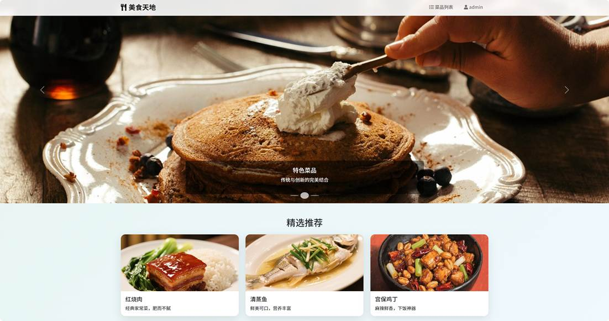
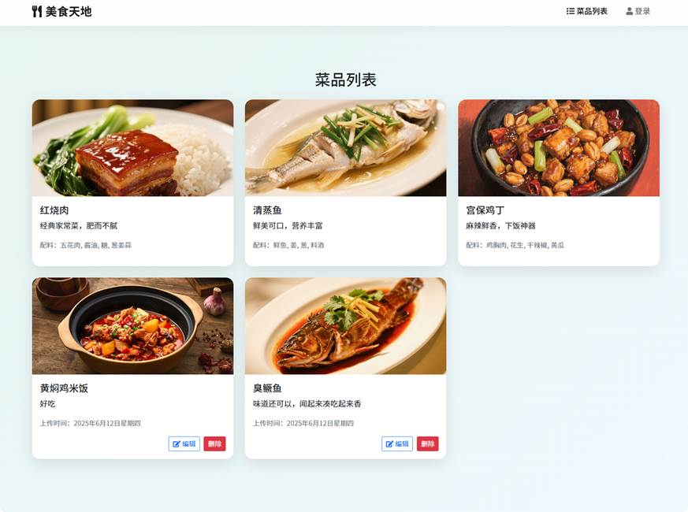
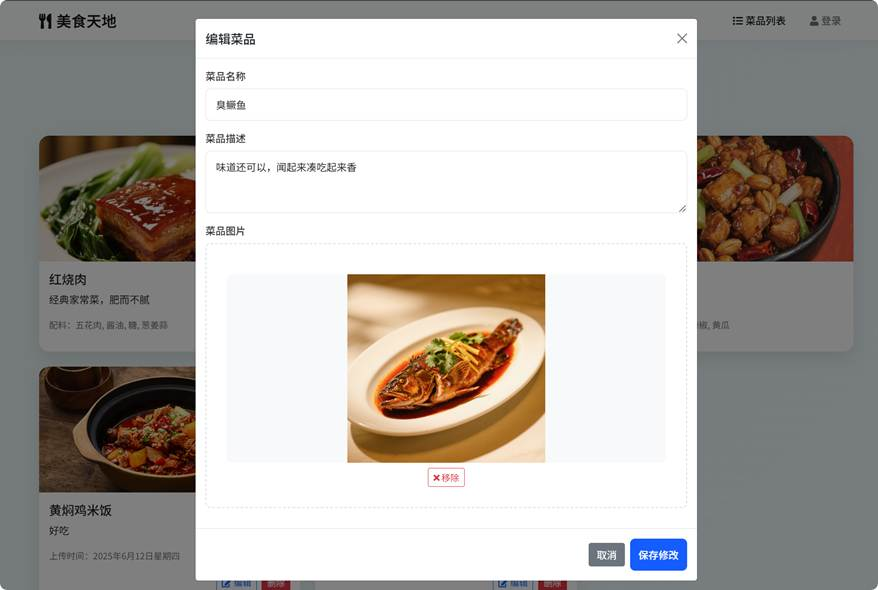
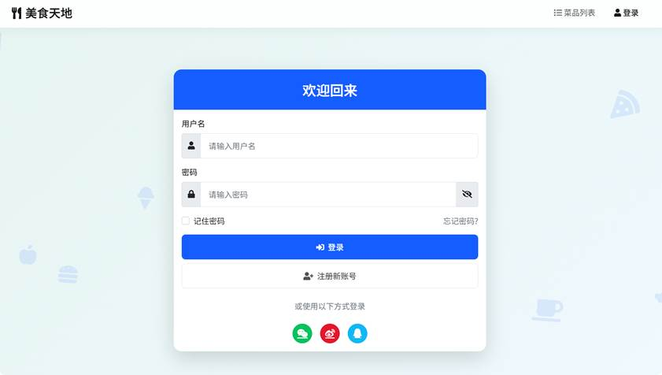
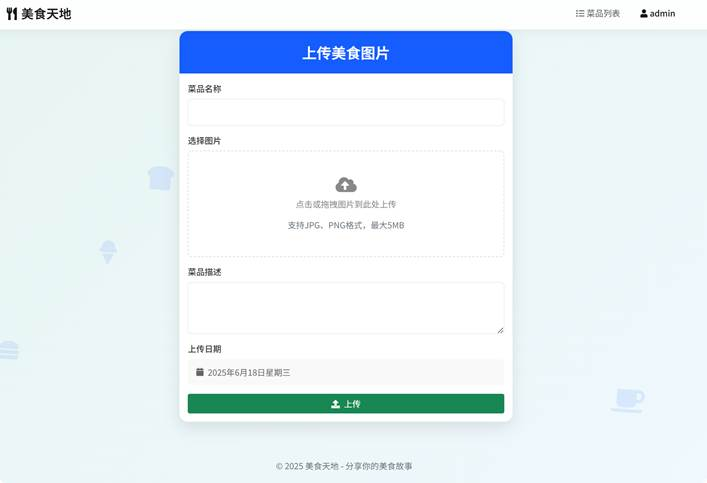

# 美食图片管理与展示平台

## 项目简介

本项目是一个基于 Node.js + Express + MySQL 的美食图片管理与展示平台，支持用户图片上传、缩略图生成、图片信息管理、前端展示等功能。适用于美食社区、图片管理、内容展示等场景。适合大学生实训demo。

---

## 使用方式（推荐优先级）

### 1. 推荐：本地浏览器直接运行（无需后端和数据库）
- **操作简单，适合体验和演示。**
- 所有数据（如菜品、用户、图片等）均保存在浏览器的 localStorage 中。
- 只需用浏览器打开 `Codes/index.html` 或 `Codes/login.html` 即可使用全部主要功能。
- **注意：** 此模式下图片上传、用户登录等功能仅在本地生效，刷新或更换浏览器数据会丢失，不支持多用户协作。

#### 步骤：
1. 克隆仓库：
   ```bash
   git clone <你的仓库地址>
   cd <项目目录>
   ```
2. 用浏览器直接打开 `Codes/index.html` 或 `Codes/login.html`。
3. 体验菜品浏览、图片上传、登录等功能。


### 效果演示

第4章 网站实现

一、首页实现

首页采用现代化的设计风格，顶部导航栏固定在页面顶部，方便用户随时访问其他页面。导航栏使用半透明背景，搭配阴影效果，提升视觉层次感。轮播图区域展示精选美食图片，每张图片配有标题和描述文字，增强视觉效果。精选推荐区域采用卡片式布局，展示特色菜品，卡片添加悬停放大效果，提升交互体验。具体界面实现如图4.1所示



​                                                                                                                 图4.1 首页实现效果图

二、菜品列表页实现

菜品列表页采用响应式网格布局，根据屏幕尺寸自动调整每行显示的菜品数量。每个菜品以卡片形式展示，包含菜品图片、名称和简介。卡片设计采用阴影效果和圆角边框，提升视觉层次感。页面支持动态加载菜品数据，通过JavaScript实现数据获取和渲染。加载过程中显示加载动画，提升用户体验。在当前界面，当用户登入后，可以实现对与当前用户的所上传过的菜品编辑操作。管理员用户可以修改和编辑所有用户上传的内容。

菜品列表的界面实现如图4.2所示。



​																										图4.2 菜品列表界面效果图

 

菜品修改的功能的布局，可以修改菜品的名称，菜品的描述，以及对上传图片的编辑，移除，或者替换。当点击编辑功能，背景会呈现灰色跳出编辑对话框，效果图如图4.3所示。

 



​																									图4.3 编辑对话框效果图

三、用户系统实现

用户系统提供完整的用户管理功能，包括登录、注册和图片上传。登录页面设计简洁美观，采用Bootstrap样式实现表单布局。表单验证通过JavaScript实现，确保用户输入符合要求。登录界面实现效果如图4.4所示。



​																									图4.4 用户登入界面效果图

四、图片上传功能实现

登录成功后，用户可以上传美食图片，系统支持图片预览和上传进度显示。图片上传功能界面效果如图4.5所示。



图4.5 图片上传界面效果图

---

### 2. 完整后端+数据库模式（需Node.js和MySQL）（未调试，仅供参考）
- 适合需要多用户协作、数据持久化、后端接口开发等场景。
- 需启动 Node.js 服务和 MySQL 数据库，前端通过接口与后端交互，所有图片和信息存储在数据库中。

#### 步骤：
1. 安装依赖：
   ```bash
   npm install
   ```
2. 配置环境变量：
   - 新建 `.env` 文件，参考如下内容：
     ```env
     PORT=3000
     UPLOAD_DIR=uploads
     DB_HOST=localhost
     DB_USER=你的数据库用户名
     DB_PASSWORD=你的数据库密码
     DB_NAME=food_app_db
     MAX_FILE_SIZE=5242880
     ALLOWED_FILE_TYPES=image/jpeg,image/png
     ```
3. 初始化数据库：
   ```bash
   mysql -u 用户名 -p < init.sql
   ```
4. 启动服务：
   ```bash
   npm start
   ```
5. 通过浏览器访问 `http://localhost:3000` 或将前端页面部署到 Web 服务器，并确保接口可用。

---

## 主要功能
- 用户登录与认证
- 图片上传、缩略图与预览图自动生成
- 图片信息管理（描述、标签等）
- 图片浏览与展示（前端页面）
- 图片删除与存储统计
- 数据库存储与访问日志（仅后端+数据库模式）

## 技术栈
- 后端：Node.js、Express、MySQL、Multer、Sharp
- 前端：HTML、CSS、JavaScript
- 依赖管理：npm

## 目录结构
```
Codes/                # 前端页面与资源
  ├── index.html      # 首页
  ├── login.html      # 登录页
  ├── dishes.html     # 菜品展示页
  ├── js/             # 前端脚本
  ├── css/            # 样式文件
  └── images/         # 图片资源
food-app-server/      # 预留后端扩展
init.sql              # 数据库初始化脚本
package.json          # Node.js 依赖配置
server.js             # 后端主服务
uploads/              # 用户上传图片存储
request-ui/           # 前端设计与需求文档
request-admin/        # 后台管理需求文档
```

## 数据库设计
- 详见 `init.sql` 和 `request-ui/database-res/` 目录下的设计文档。
- 主要表：
  - `images`：图片信息表
  - `image_thumbnails`：缩略图信息表
  - `image_access_logs`：访问日志表
  - `image_storage_stats`：用户存储统计表

## 主要接口说明（后端+数据库模式）
- `POST /api/v1/images/upload`：图片上传
- `GET /api/v1/images/:imageId`：获取图片信息
- `DELETE /api/v1/images/:imageId`：删除图片

## 贡献方式
欢迎提交 issue 或 pull request 参与项目改进！

## 许可证
本项目采用 MIT License 开源。详情见 LICENSE 文件。

## 致谢
感谢所有为本项目做出贡献的开发者与设计者。 

## 作者
[BOB (xiaogui197) on GitHub](https://github.com/xiaogui197)

- #### 微信：openbob（欢迎技术交流与合作，可定制需求） 
- 
- #### 给小哥加个鸡腿
- 